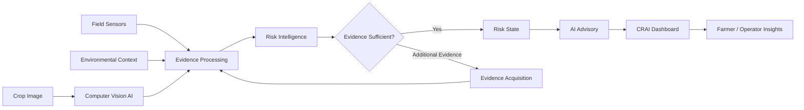

<div align="center">

# 🌱 CRAI — Crop Risk AI

### Intelligent Crop-Risk Monitoring & Agricultural Decision Support

**Computer Vision · IoT · Environmental Intelligence · Risk Analytics · AI Advisory**

[](https://react.dev/)
[](https://vitejs.dev/)
[](https://www.python.org/)
[](https://fastapi.tiangolo.com/)
[](https://pytorch.org/)
[](https://www.espressif.com/)

<br/>

> **CRAI turns crop observations and field evidence into structured crop-risk intelligence that can be understood and acted upon.**

</div>

---

## 🌾 Project Overview

**CRAI (Crop Risk AI)** is a smart-agriculture platform for observing crop conditions, combining multiple evidence sources, and presenting risk-oriented insights through a modern web dashboard.

The platform follows a simple principle:

> **Observe → Understand → Correlate → Advise**

Instead of treating a crop image, sensor reading, or environmental signal as an isolated event, CRAI brings available evidence together into a unified decision-support workflow.

### Intelligence Layers

| Layer | Role |
|---|---|
| 🌿 **Crop Vision** | Analyze crop images for potential disease or abnormal conditions |
| 🌡️ **Field Sensing** | Capture environmental and field observations |
| 🧩 **Evidence Intelligence** | Correlate available observations before forming a broader risk view |
| 🧠 **Risk Intelligence** | Translate evidence into a structured crop-risk state |
| 💬 **AI Advisory** | Convert technical analysis into understandable agricultural guidance |
| 📊 **Monitoring Platform** | Present observations and intelligence through one dashboard |

---

## ✨ Core Capabilities

| Capability | Description |
|---|---|
| 🌿 **Crop Image Intelligence** | AI-assisted crop image analysis for potential disease-related conditions |
| 🌡️ **Field & Environmental Awareness** | Sensor observations add context around crop conditions |
| 🧩 **Multi-Source Intelligence** | Combines different evidence types into a broader crop-risk view |
| 🔎 **Evidence-Aware Workflow** | Additional evidence can be requested when available information is insufficient |
| 🧠 **AI Advisory** | LLM-assisted layer converts analysis into human-readable guidance |
| 📡 **Live Monitoring** | Live observation, sensor status and system health |
| 🕘 **History** | Review previous observations and analysis |
| 📑 **Reports** | Structured reporting and review |
| ⚙️ **System Controls** | Application and system configuration |

---

## 🧠 System Architecture



### End-to-End Flow

**Crop / Field → Observation → Evidence Processing → Risk Intelligence → Advisory → Dashboard**

The public repository documents the architecture at a conceptual level. Private decision rules, model artifacts, unpublished thresholds, prompts and research implementation remain outside this showcase repository.

---

## 🏗️ Application Modules

| Module | Purpose |
|---|---|
| **Overview** | High-level crop and system status |
| **Observe** | Crop observation and image-analysis workflow |
| **Intelligence** | Risk-oriented analysis and AI insights |
| **Sensors** | Field-sensor observations and device status |
| **History** | Previous observations and analysis |
| **Reports** | Structured reporting and review |
| **Settings** | Application and system configuration |

---

## 🛠️ Technology Stack

### Frontend
- React 18
- Vite
- JavaScript / ES Modules
- React Hooks
- Fetch API
- Local Storage
- Responsive SaaS-style dashboard UI

### Backend
- Python 3
- FastAPI
- Uvicorn
- Pydantic / Pydantic Settings
- SQLAlchemy
- SQLite for local engineering workflows
- REST API architecture

### AI / ML
- PyTorch
- TorchVision
- Computer Vision
- Image preprocessing
- ML-based risk modelling components
- Local LLM-assisted advisory
- Data and model evaluation workflows

### Edge / IoT
- ESP32
- Environmental sensing
- Device-to-application communication
- Real vs. simulated observation handling
- Field evidence acquisition

### Engineering
- Git & GitHub
- VS Code
- npm
- Python virtual environments
- PowerShell
- HTTP/API testing
- GitHub Actions

---

## 🔌 Integration Surface

The public frontend is structured around a REST integration layer with capabilities including:

| Endpoint | Purpose |
|---|---|
| `/api/health` | System health |
| `/api/ai/status` | AI service status |
| `/api/observations` | Observation retrieval |
| `/api/live/latest` | Latest live observation |
| `/api/live/image` | Latest live image |
| `/api/field-sensors/readings` | Sensor observations |
| `/api/field-sensors/requests/pending` | Evidence acquisition requests |
| `/api/field-sensors/requests` | Create sensor/evidence requests |
| `/api/analysis/image` | Crop image analysis |

> **Public-repository boundary:** private model weights, datasets, credentials, internal prompts, unpublished thresholds and proprietary decision logic are intentionally excluded.

---

## 📁 Repository Structure

```text
CRAI-Crop-Risk-AI/
├── frontend/
│   ├── src/
│   │   ├── components/
│   │   ├── hooks/
│   │   ├── pages/
│   │   ├── services/
│   │   └── utils/
│   ├── package.json
│   ├── package-lock.json
│   └── vite.config.js
│
├── backend/
│   └── requirements.txt
│
├── docs/
│   ├── ARCHITECTURE.md
│   ├── TECH-STACK.md
│   └── DEMO.md
│
├── .github/
│   └── workflows/
│       └── frontend-build.yml
│
├── CONTRIBUTING.md
├── SECURITY.md
├── LICENSE
└── README.md
```

---

## 🚀 Run the Public Frontend

### Prerequisites

- Node.js 20+ recommended
- npm

### Install

```bash
cd frontend
npm install
```

### Configure the API

Create a local environment file:

```powershell
Copy-Item .env.example .env
```

Set the backend URL when connecting to a running CRAI backend:

```env
VITE_API_URL=http://127.0.0.1:8000
```

### Start

```bash
npm run dev
```

Open:

```text
http://localhost:5173
```

### Production build

```bash
npm run build
```

> The complete engineering backend and AI implementation is maintained separately from this public showcase.

---

## 🧪 Engineering Philosophy

### Evidence before assumption
Available observations should be considered before forming a broader risk interpretation.

### Decision before decoration
The interface prioritizes useful system state and decision context over unnecessary visual complexity.

### Explainable intelligence
AI outputs should be understandable enough for a human to review.

### Human-in-the-loop agriculture
CRAI is designed as a decision-support platform, not a replacement for agricultural expertise.

---

## 🔐 Public Showcase & Intellectual Property

This repository is the **public product showcase** for CRAI.

The complete engineering implementation is maintained separately. The public repository deliberately excludes:

- Private model weights
- Private datasets
- Credentials and secrets
- Internal prompts
- Proprietary decision rules
- Internal thresholds
- Unpublished research artifacts
- Sensitive experimental data

See [SECURITY.md](SECURITY.md) for repository handling guidelines.

---

## 📌 Project Status

**Active development / prototype**

Current engineering focus:

- Crop image intelligence
- Field-sensor integration
- Multi-source crop-risk intelligence
- AI-assisted agricultural advisory
- Live monitoring
- Reliability and demo readiness
- Dashboard and reporting refinement

---

## 📚 Documentation

- [Architecture](docs/ARCHITECTURE.md)
- [Technology Stack](docs/TECH-STACK.md)
- [Demo Guide](docs/DEMO.md)
- [Security](SECURITY.md)
- [Contributing](CONTRIBUTING.md)

---

<div align="center">

### 🌱 CRAI — From Field Evidence to Crop Intelligence

**Observe. Correlate. Understand. Act.**

</div>
